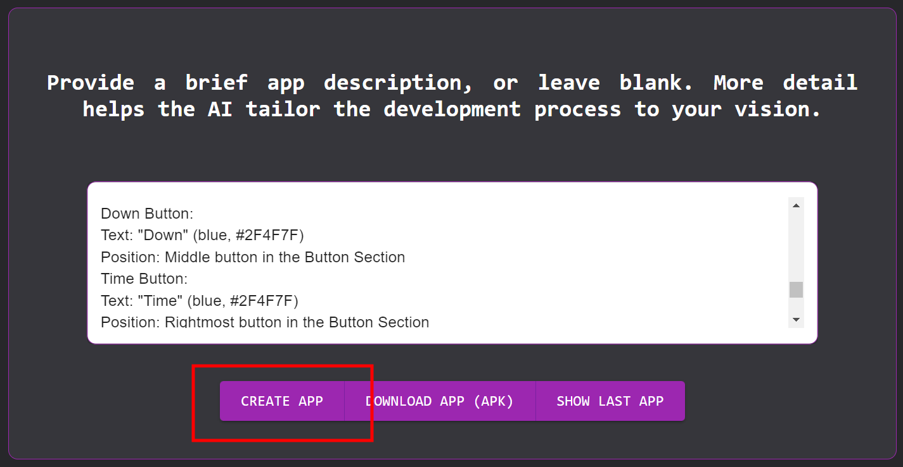
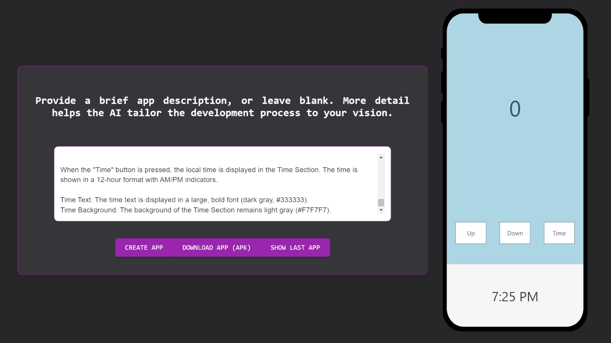

# Txt2App: Transforming Ideas into Mobile apps


Txt2App: Turn any idea into a fully functional mobile app, powered by LLM and Nvidia AI Workbench.

# Introduction:

In an increasingly technology-driven world, the ability to develop mobile apps shouldn't be reserved for expert programmers only. Nvidia CEO Jensen Huang has highlighted the need to focus on learning prompt engineering rather than traditional programming, noting: "It is our job to create computing technology such that nobody has to program. And that the programming language is human." [1](#references)


**LLMs** provide the ability to process natural language input and text generation (not limited to natural language), which is an indispensable tool to achieve this goal. [2](#references)


The **Nvidia AI Workbench** offers a robust environment for the creation, training and optimization of container-based artificial intelligence models. Above all, it allows the use of resources both on the local machine and on external servers, facilitating rapid development from ready-to-work environments, thus accelerating development times. [3](#references)


# Problem:

Developing mobile applications presents several challenges: [4](#references)

- **Code Complexity**: Mobile app programming involves writing and debugging code, which can be difficult without strong technical expertise.

- **Diversity of frameworks, versions, and platforms**: Ensuring that an application works optimally on different devices requires managing multiple versions and configurations, which can complicate the development process.

- **UI/UX Design**: Designing a good UI/UX that meets the expectations of users, who are already accustomed to established and current design patterns, can be an even more challenging task than developing the app's own backend.

<br>


# Current Solutions:

- Flutter Flow: This solution provides tools for interface design, but does not provide any AI capabilities. https://www.flutterflow.io/product

- Appypie: This text to app solution allows you to create applications with just a text prompt, however it requires a subscription, is closed source, and the demo provided by the page does not provide evidence of the use of AI. https://www.appypie.com/

- UI Bakery: Although this page better demonstrates AI-based interface design, it does not provide any functionality to the app, only generating base designs. https://uibakery.io/

# Solution: 

Introducing **Txt2App**, Huang's promise becomes a reality, accessible to everyone, democratizing application development and opening up new possibilities for technology creation thanks to Nvidia Ai Workbench and LLMs (Generative AI).


# Diagram and Summary:

The general diagram of our solution is as follows, this is a summary of the services, detail description of each one on our Github: https://github.com/altaga/Txt2App.


- Google Cloud VM: We are using a Google VM with the following features.
  - OS: Ubuntu 24.04 LTS.
  - GPU: Nvidia Tesla T4 (16Gb).
  - RAM: 65 Gb.
  - HDD: 500 Gb.
  - vCPU: 10 cores.
- Nvidia AI Workbench: The Nvidia toolkit is used to perform rapid development and deployment of our application.
  - https://docs.nvidia.com/ai-workbench/user-guide/latest/overview/introduction.html
- Ollama Server: We use the Ollama server service to run the LLM models used in the project.
  - LLM Model: Deepseek Coder V2.
    - https://ollama.com/library/deepseek-coder-v2
- ReactJS: This was the web framework to create the project's UI, we used pure ReactJS without any additional framework.
  - Main UI: This is the main interface of the project where the text window and the App preview are displayed.
  - App Preview: This interface pre-renders the app for the user to test before converting it to APK.
- React Native:
  - App Builder: Android Native Build is used to convert React code into Android native code.
- Fastapi: We use this framework to create the complete API of our application.
  - Static Website: This section of the API is used as a server to display the UI from the browser.
  - API: This section communicates the UI with the generation, preview and build services.

# Txt2App:

Now, it is time to show how our webapp is used.


## Prompt:

The first thing that is important to clarify is that our AI is an LLM, therefore making a good description of your application will directly affect its quality, therefore we recommend that you be as specific as possible when creating an app.

Example Prompt
```
The app, titled "Counter Pro," is a simple yet intuitive application that allows users to count up and down using two buttons. Additionally, it features a third button that displays the local time on the screen.

Design Overview

The app's design is clean, modern, and easy to use. The color scheme is a combination of calming blues and whites, which provides a soothing user experience.

Layout

The app's layout is divided into three main sections, arranged using a flex layout:

Counter Section: This section takes up the majority of the screen and displays the current count in a large, bold font.
The background color of this section is a light blue (#ADD8E6).
The text color is a deep blue (#2F4F7F).
Position: This section is placed at the top of the screen, taking up about 60% of the screen height.
Button Section: This section contains three buttons: "Up," "Down," and "Time."
The buttons are arranged horizontally and are evenly spaced using justify-content: space-between.
Each button has a white background (#FFFFFF) and a blue border (#2F4F7F).
The button text is also blue (#2F4F7F).
Position: This section is placed below the Counter Section, taking up about 20% of the screen height.
Time Section: This section is displayed below the Button Section and shows the local time when the "Time" button is pressed.
The background color of this section is a light gray (#F7F7F7).
The text color is a dark gray (#333333).
Position: This section is placed at the bottom of the screen, taking up about 20% of the screen height.
Button Descriptions

Up Button:
Text: "Up" (blue, #2F4F7F)
Position: Leftmost button in the Button Section
Down Button:
Text: "Down" (blue, #2F4F7F)
Position: Middle button in the Button Section
Time Button:
Text: "Time" (blue, #2F4F7F)
Position: Rightmost button in the Button Section
Time Display

When the "Time" button is pressed, the local time is displayed in the Time Section. The time is shown in a 12-hour format with AM/PM indicators.

Time Text: The time text is displayed in a large, bold font (dark gray, #333333).
Time Background: The background of the Time Section remains light gray (#F7F7F7).
```

Once you have entered the description, you must press the Create App button.



You will have to wait a few seconds for the LLM to generate your app. During this process, a waiting window will appear on your cell phone. Be patient, depending on your system, it could take between 10 - 30 seconds.

## Preview and Test:

We can see that the application we generated is fully functional and meets the requirements we requested. Remember that the more specific you are, the better the application will perform.



## Build and Download:

Then, if the result is suitable for us, we will press the Download APK button, this will generate our APK which you can install on any Android device or even upload it to the Playstore. The first time you generate an APK it may take a few minutes due to the setup of some dependencies required by React Native, the following builds will be done in less than 1 min.


## Install the App:

Finally, since the application is fully functional, you can install it using the command `adb install -r txt2app.apk`.

 

You can see that the app is fully functional in the same way it works in our web simulator, we invite you to create your own applications.

# Commentary:

Txt2App is a groundbreaking solution designed to revolutionize the way mobile applications are developed. Leveraging the power of large language models (LLM) and Nvidia's AI Workbench, Txt2App enables users to turn any idea into a fully functional mobile app with ease. This innovative tool lowers the barriers to app development by automating many of the complex, technical tasks that traditionally require extensive programming knowledge. Whether you're an entrepreneur with a vision or a business looking for custom solutions, Txt2App simplifies the journey from concept to deployment.

### Empowering Users with Cutting-Edge AI

By integrating Nvidia's AI Workbench, Txt2App harnesses cutting-edge machine learning models to interpret natural language inputs and generate corresponding app features. This means users can describe their ideas in plain text, and Txt2App will handle the heavy lifting of coding, UI/UX design, and backend infrastructure. This fusion of LLM and AI-driven technology drastically reduces development time, while ensuring that the final product meets high performance and functionality standards.

### A New Era for App Development

Txt2App marks a significant shift in how applications are conceptualized, created, and delivered. It democratizes app development, making it accessible to non-technical users without compromising on the quality or complexity of the applications produced. As the world becomes increasingly mobile-centric, Txt2App opens doors for individuals and businesses to innovate and adapt swiftly, fostering a more inclusive and dynamic app ecosystem.

<br>


# References:

1. https://www.forbes.com/sites/timbajarin/2024/03/20/nvidias-ceo-on-the-democratization-of-coding/
2. https://ai.meta.com/blog/meta-llama-3/
3. https://docs.nvidia.com/ai-workbench/index.html
4. https://www.netguru.com/blog/mobile-app-challenges


