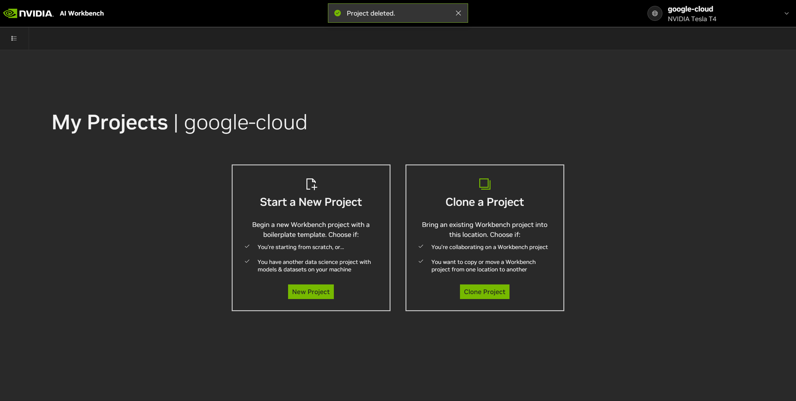
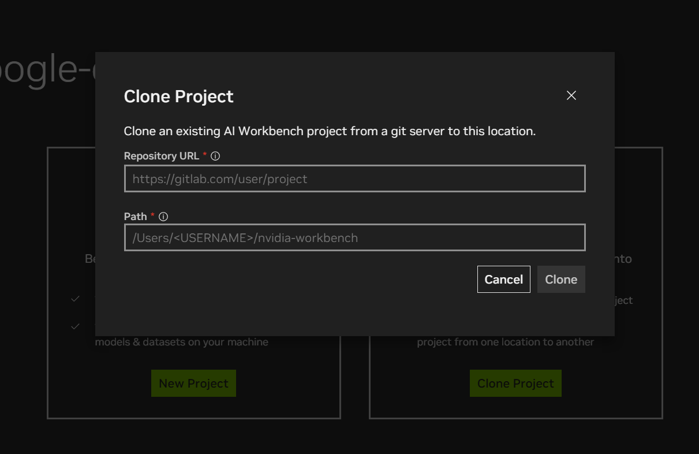
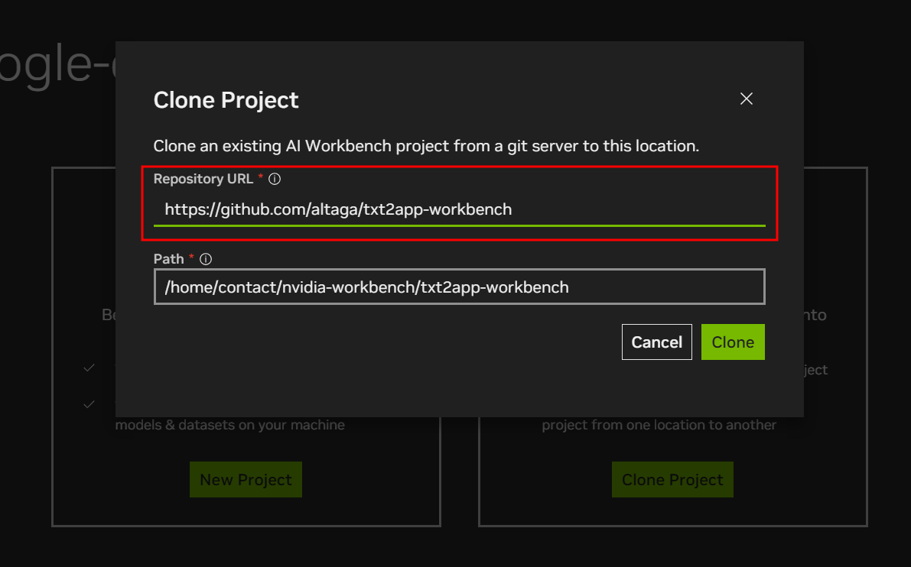
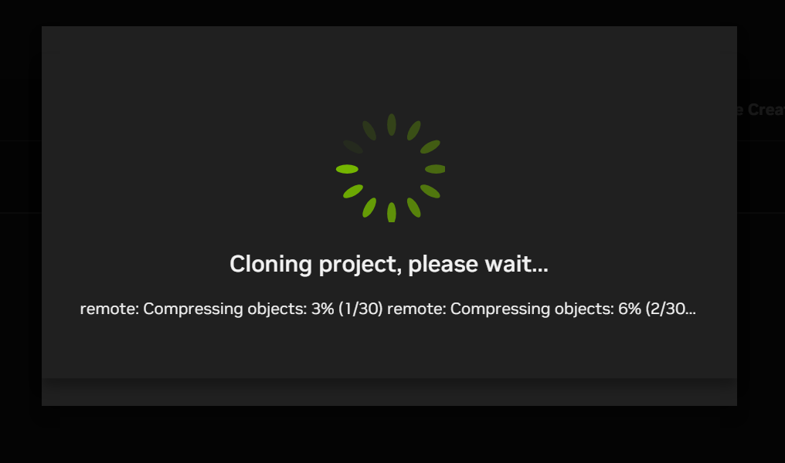
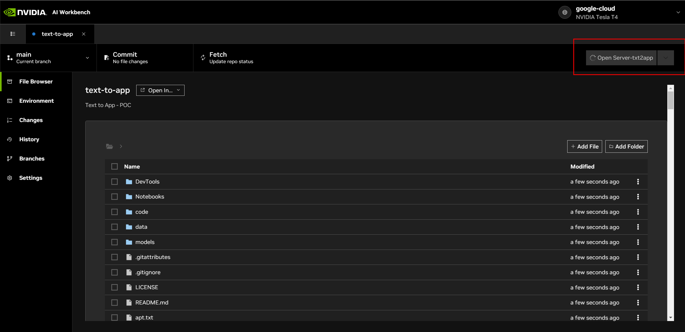
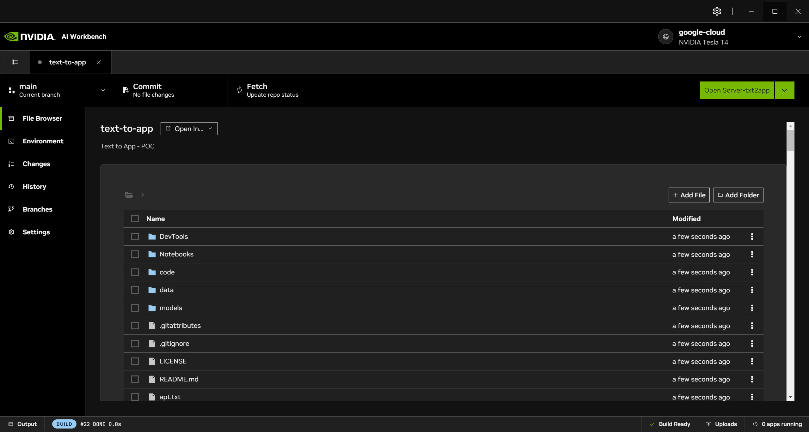
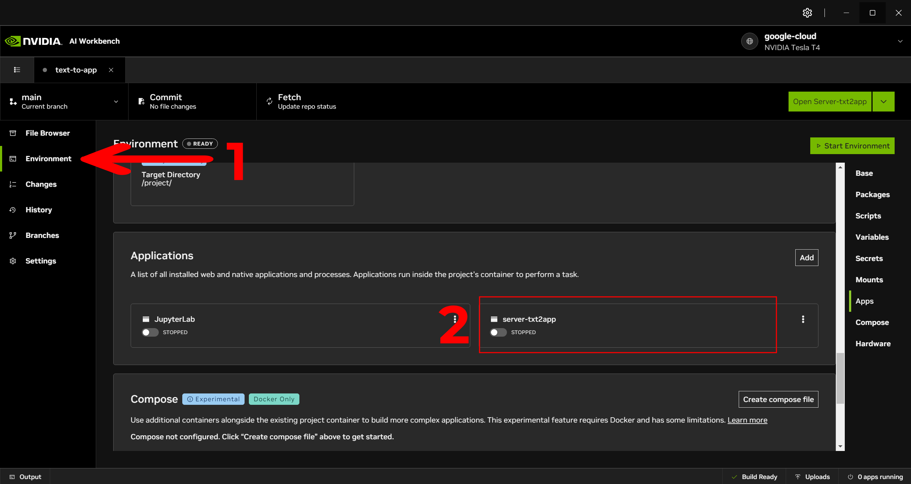
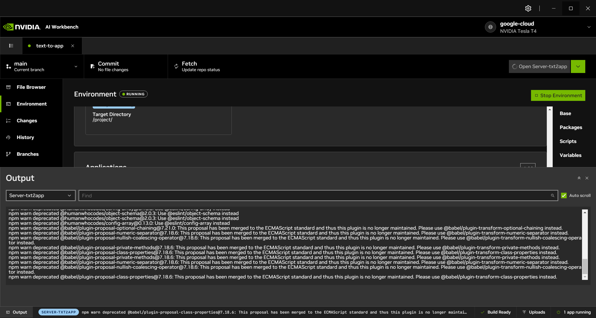
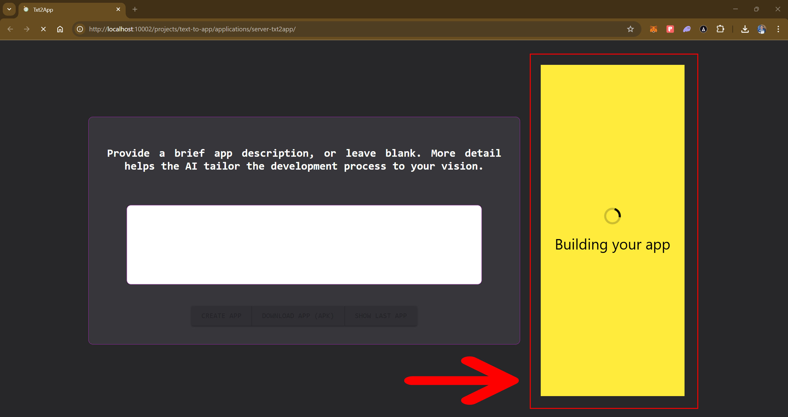
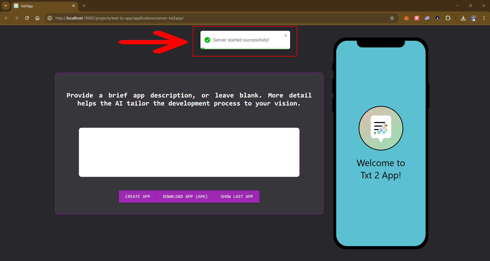

# This is a tutorial to run the Ai Workbench on any machine.

- Open your Nvidia Ai Workbench:

- Press the "Clone Project" button.

- Paste the following link into the Repository URL box: `https://github.com/altaga/txt2app-workbench`

- This repository that we pasted is the repository that we created to make it easier to distribute and replicate our project in an Nvidia AI Workbench.

- If everything works correctly the project will open automatically.

- Please wait for the project to finish configuring, you will notice this when the box that says "Open Server-txt2app" turns green.

- Now we will click on the left menu "Environment" and scroll until we see the Applications section.

- We will press the server-txt2app toggle button, the first time you start this application it will take between 1 and 2 minutes, depending on your machine and internet connection, this happens because the NodeJS server dependencies are being installed.

- If everything goes well, your browser will open automatically with the web app, which may indicate that it is still loading as shown below.

- Finally, when the app is completely ready to use, it will look like the one below. You can now start creating an app, although if you leave the box empty, we will create a sample app for you.

