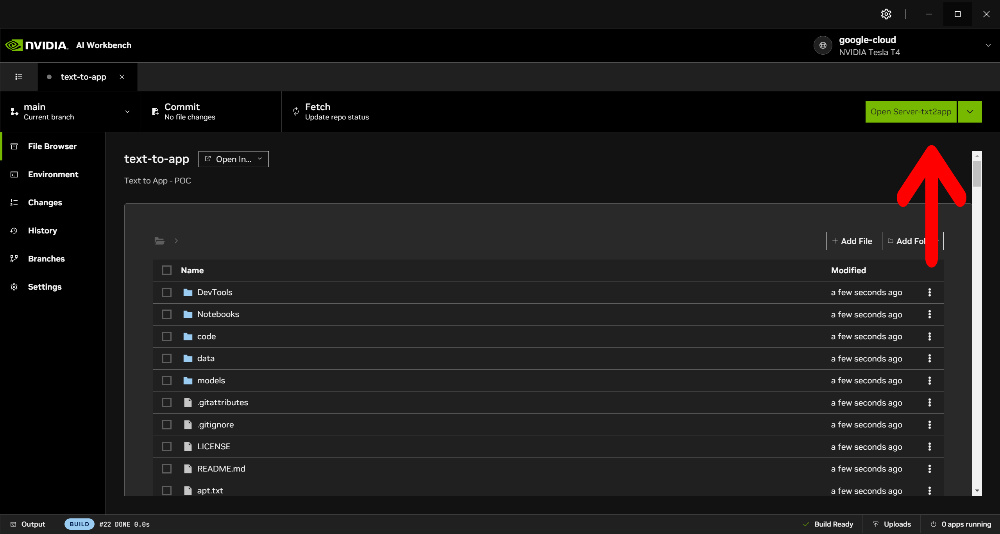

# Txt2App: Transforming Ideas into Mobile apps

This is a tutorial to run the Ai Workbench on any machine.

# IMPORTANT LINKS:

### **Nvidia Ai Workbench Repository**: [READY TO CLONE REPO](https://github.com/altaga/txt2app-workbench)

# Tutorial:

- Open your Nvidia Ai Workbench:

- Press the "Clone Project" button.

- Paste the following link into the Repository URL box: `https://github.com/altaga/txt2app-workbench`

- This repository that we pasted is the repository that we created to make it easier to distribute and replicate our project in an Nvidia AI Workbench.

- If everything works correctly the project will open automatically.

- Please wait for the project to finish configuring, you will notice this when the box that says "Open Server-txt2app" turns green.

- Now we will click on the left menu "Environment" and scroll until we see the Applications section.

- We will press the server-txt2app toggle button, the first time you start this application it will take between 1 and 2 minutes, depending on your machine and internet connection, this happens because the NodeJS server dependencies are being installed.

- Finally, if everything goes well, your browser will open automatically with the web app, which may indicate that it is still loading as shown below.

- Finalmente cuando la app este completamente lista para usarse, se vera como aparece a continuacion, ahora si puedes empezar a crear cualquier app, aunque si dejas la casilla vacia, te crearemos una app de muestra.

