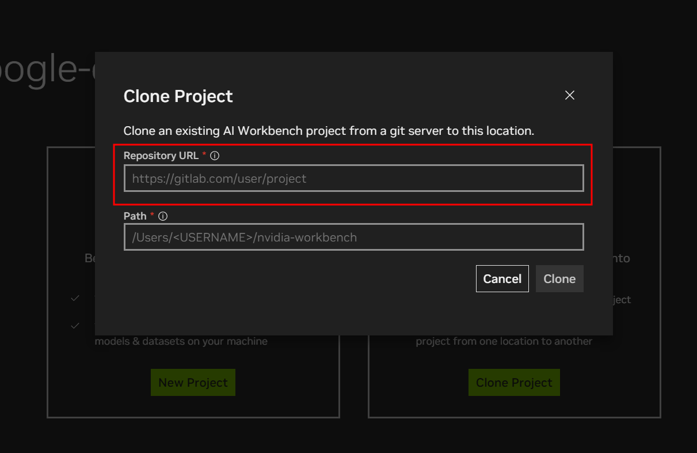

# Txt2App: Transforming Ideas into Mobile apps

Este es un tutorial de como correr el Ai Workbench en cualquier maquina.

# IMPORTANT LINKS:

### **Nvidia Ai Workbench Repository**: [READY TO CLONE REPO](https://github.com/altaga/txt2app-workbench)

# Tutorial:

- Abre tu Nvidia Ai Workbench:

- Presiona el boton de "Clone Project".

- Pega el siguiente link en la casilla de Repository URL `https://github.com/altaga/txt2app-workbench`

- Este repositorio que pegamos es el repositorio que creamos para hacer mas facil la distrubucion y replica de nuestro proyecto en un Nvidia AI Workbench.

- Si todo funciona correctamente el proyecto abrira de forma automatica.

- Porfavor espera a que el proyecto termine de configurarse, esto lo notaras cuando el cuadro que dice "Open Server-txt2app" este en color verde.

- Ahora pesionaremos en el menu izquierdo "Environment" y scrollea hasta ver la seccion de Applications.

- Presionaremos el toogle buttno de server-txt2app, la primera vez que inicialices esta aplicacion tardara entre 1 y 2 minutos, dependiendo de tu maquina y la conexion a internet, esto ocurre porque se estan instalando las dependencias del servidor de NodeJS.

- Finalmente si todo sale bien se abrira tu navegador de forma automatica con la web app, esta puede indicar que sigue cargandose como se muestra a continuacion.

- Finalmente cuando la app este completamente lista para usarse, se vera como aparece a continuacion, ahora si puedes empezar a crear cualquier app, aunque si dejas la casilla vacia, te crearemos una app de muestra.

