# Txt2App: Transforming Ideas into Mobile apps


Txt2App: Turn any idea into a fully functional mobile app, powered by LLM and Nvidia AI Workbench.

# Fastlinks:

Hi!, if you are a judge and want to review the code and the Nvidia Ai Workbench Container here are the links:

## **Nvidia Ai Workbench Container**: [OPEN VIDEO](pending...)
## **Video Demo**: [OPEN VIDEO](pending...)
## **Blog Post**: [Click here](https://github.com/altaga/Txt2App/blob/main/BlogPost.MD)

# Introduction:

In an increasingly technology-driven world, the ability to develop mobile apps shouldn't be reserved for expert programmers only. Nvidia CEO Jensen Huang has highlighted the need to focus on learning prompt engineering rather than traditional programming, noting: "It is our job to create computing technology such that nobody has to program. And that the programming language is human." [1](#references)


**LLMs** provide the ability to process natural language input and text generation (not limited to natural language), which is an indispensable tool to achieve this goal. [2](#references)

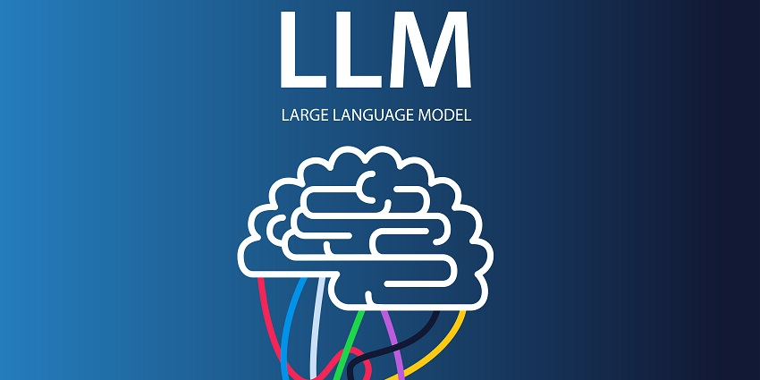

The **Nvidia AI Workbench** offers a robust environment for the creation, training and optimization of container-based artificial intelligence models. Above all, it allows the use of resources both on the local machine and on external servers, facilitating rapid development from ready-to-work environments, thus accelerating development times. [3](#references)

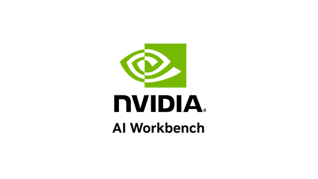

# Problem:

Developing mobile applications presents several challenges: [4](#references)

- **Code Complexity**: Mobile app programming involves writing and debugging code, which can be difficult without strong technical expertise.

- **Diversity of frameworks, versions, and platforms**: Ensuring that an application works optimally on different devices requires managing multiple versions and configurations, which can complicate the development process.

- **UI/UX Design**: Designing a good UI/UX that meets the expectations of users, who are already accustomed to established and current design patterns, can be an even more challenging task than developing the app's own backend.

<br>

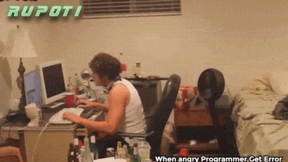

# Current Solutions:

- Flutter Flow: This solution provides tools for interface design, but does not provide any AI capabilities. https://www.flutterflow.io/product

- Appypie: This text to app solution allows you to create applications with just a text prompt, however it requires a subscription, is closed source, and the demo provided by the page does not provide evidence of the use of AI. https://www.appypie.com/

- UI Bakery: Although this page better demonstrates AI-based interface design, it does not provide any functionality to the app, only generating base designs. https://uibakery.io/

# Solution: 

Introducing **Txt2App**, Huang's promise becomes a reality, accessible to everyone, democratizing application development and opening up new possibilities for technology creation thanks to Nvidia Ai Workbench and LLMs (Generative AI).


# Diagram and Summary:

The general diagram of our solution is as follows, this is a summary of the services, but we will detail them later.


- Google Cloud VM: We are using a Google VM with the following features.
  - OS: Ubuntu 24.04 LTS.
  - GPU: Nvidia Tesla T4 (16Gb).
  - RAM: 65 Gb.
  - HDD: 500 Gb.
  - vCPU: 10 cores.
- Nvidia AI Workbench: The Nvidia toolkit is used to perform rapid development and deployment of our application.
  - https://docs.nvidia.com/ai-workbench/user-guide/latest/overview/introduction.html
- Ollama Server: We use the Ollama server service to run the LLM models used in the project.
  - LLM Model: Deepseek Coder V2.
    - https://ollama.com/library/deepseek-coder-v2
- ReactJS: This was the web framework to create the project's UI, we used pure ReactJS without any additional framework.
  - Main UI: This is the main interface of the project where the text window and the App preview are displayed.
  - App Preview: This interface pre-renders the app for the user to test before converting it to APK.
- React Native:
  - App Builder: Android Native Build is used to convert React code into Android native code.
- Fastapi: We use this framework to create the complete API of our application.
  - Static Website: This section of the API is used as a server to display the UI from the browser.
  - API: This section communicates the UI with the generation, preview and build services.

# Google VM:

Selecting the type of virtual machine for the project was a simple task, especially considering that Google offers a wide variety of Nvidia GPUs. After performing some tests on the computer, it was decided to use a VM with the following characteristics.

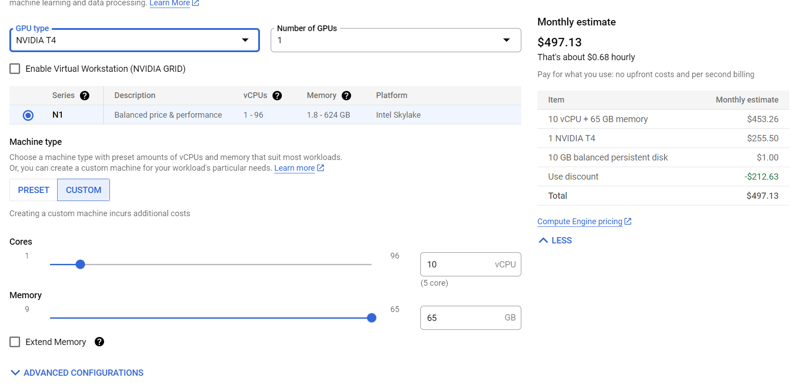

<br>

VM Selection Summary:

| HW/SW  | Selected Value         |
| ------ | ---------------------- |
| OS     | Ubuntu 24.04 LTS       |
| GPU    | Nvidia Tesla T4 (16Gb) |
| RAM    | 65 Gb                  |
| HDD    | 500 Gb                 |
| vCPU   | 10 cores               |

A fairly powerful machine was used in terms of RAM and vCPU since we had to experiment with the best selection of LLM models and not have problems with resource limitations, this of course considering that we were not going to use models like the llama3 405b, which occupy very expensive HW resources.

## SSH Setup:

Something important that must be configured so that we do not have any problems in the next section is the SSH access configuration that we require to configure the VM and access through the Nvidia AI Workbench.

- On our local PC we will have to create an RSA Keypair, this can be done in many ways, however we will use the `ssh-keygen` command from the OpenSSH library.

  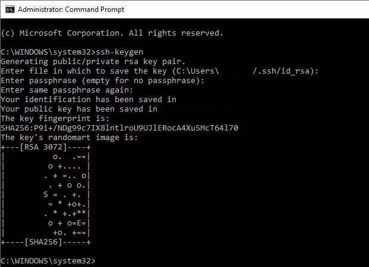

- The private key will already be in our .shh folder but we will use the data from the id_rsa.pub file, which is the public key.
  
  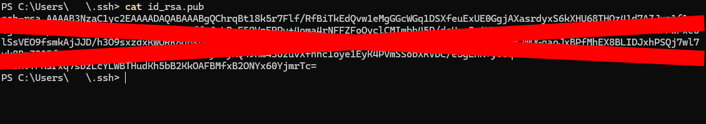

- We will go to the bottom section of the VM configuration:

  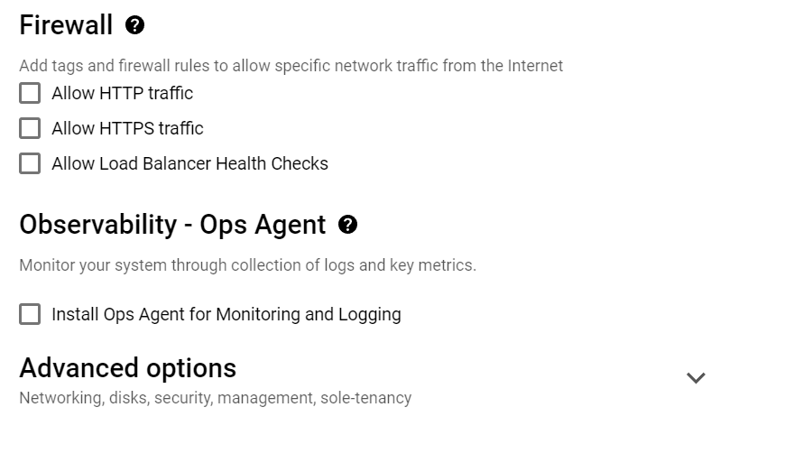

- We select Advanced Options - Security - Manage Access - Add manually generated SSH keys, there we will place the public key from the id_rsa.pub file.

  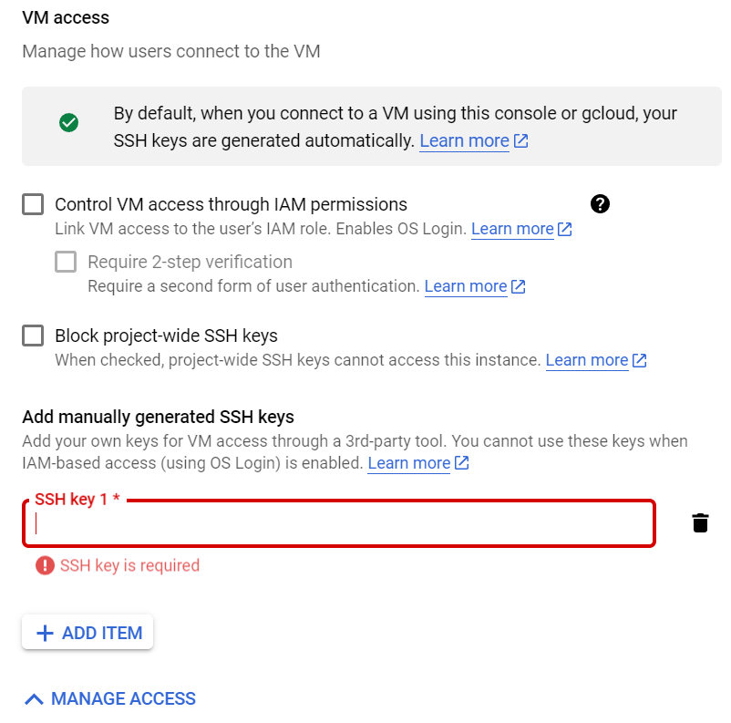

- Once this is done, we will be ready to use the VM without any problems via SSH, the VM's IP address will be available after a few seconds.

  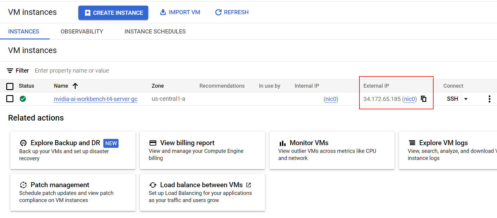

# Nvidia AI Workbench:

Once the VM is configured, we will have to connect to it via SSH to configure it. You can do this with any program for that purpose, even GC provides you with a web interface to perform this process without any problem.

## Ubuntu Remote Install: 
- Open an SSH terminal in your preferred program (e.g. the GC web ui).
  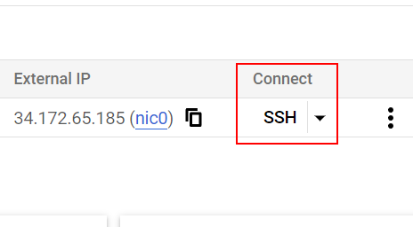

- Once inside the VM we will put the following command without further ado.

      mkdir -p $HOME/.nvwb/bin && \
      curl -L https://workbench.download.nvidia.com/stable/workbench-cli/$(curl -L -s https://workbench.download.nvidia.com/stable/workbench-cli/LATEST)/nvwb-cli-$(uname)-$(uname -m) --output $HOME/.nvwb/bin/nvwb-cli && \
      chmod +x $HOME/.nvwb/bin/nvwb-cli && \
      sudo -E $HOME/.nvwb/bin/nvwb-cli install

- This command will install all the dependencies of Nvidia AI Workbench, but we will go step by step, you will have to accept the terms of use of the program.

  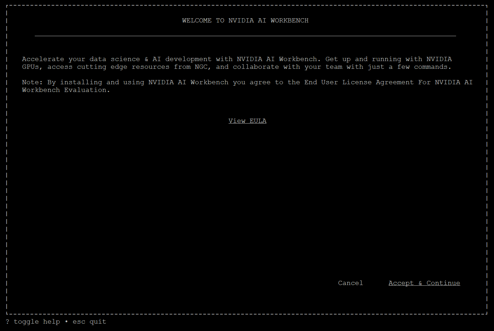

- Docker was used for this project, but you can experiment with Podman if you want.

  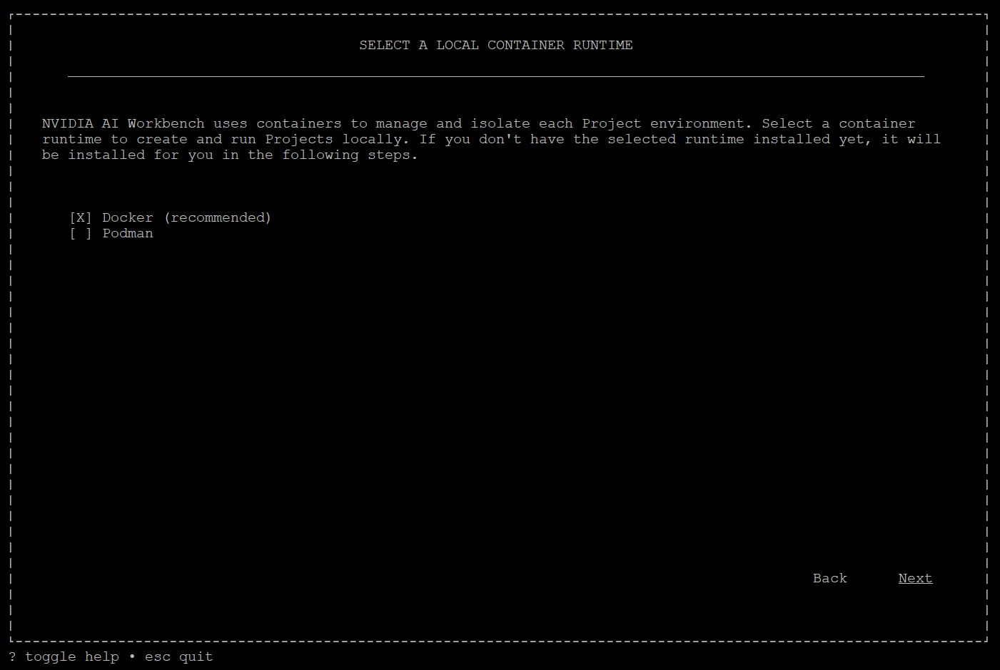

- We recommend here that you install the drivers as indicated by Nvidia AI Workbench, in our virtual machine it worked without any problem.
  
  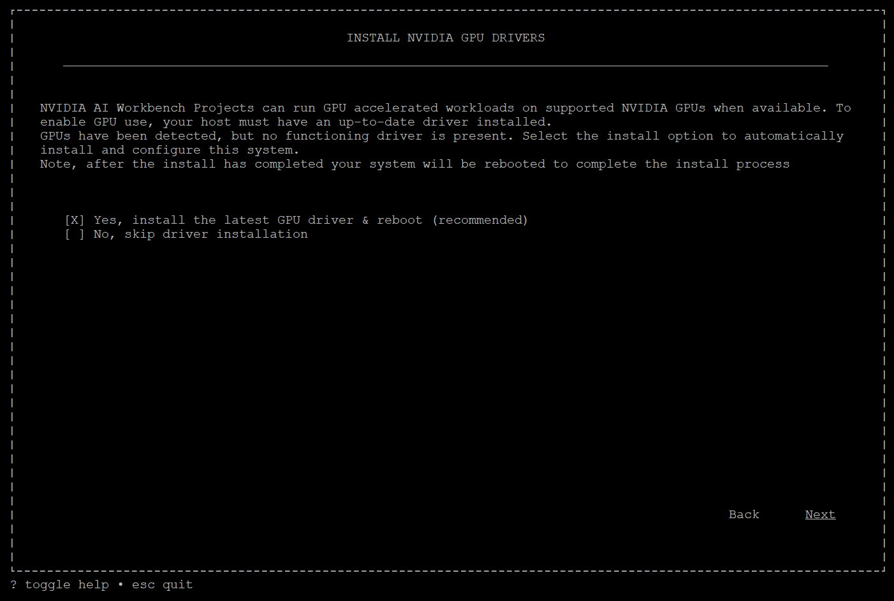

- The installation process will begin, depending on your VM it may take less than 2 min or more than 5 min as indicated by Nvidia AI Workbench, however when using a Google VW there will be no problem due to internet speed.

  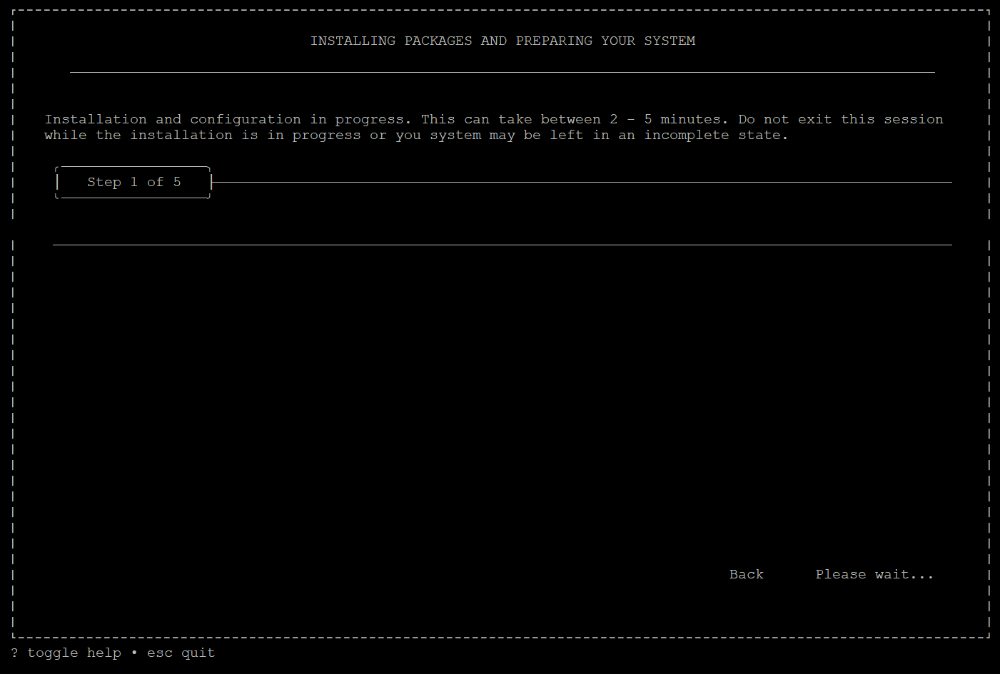

- Once the entire process is finished, the VM will restart, this will close our SSH session, however it will no longer be necessary, we will now be able to access it from our Local Nvidia AI Workbench.

  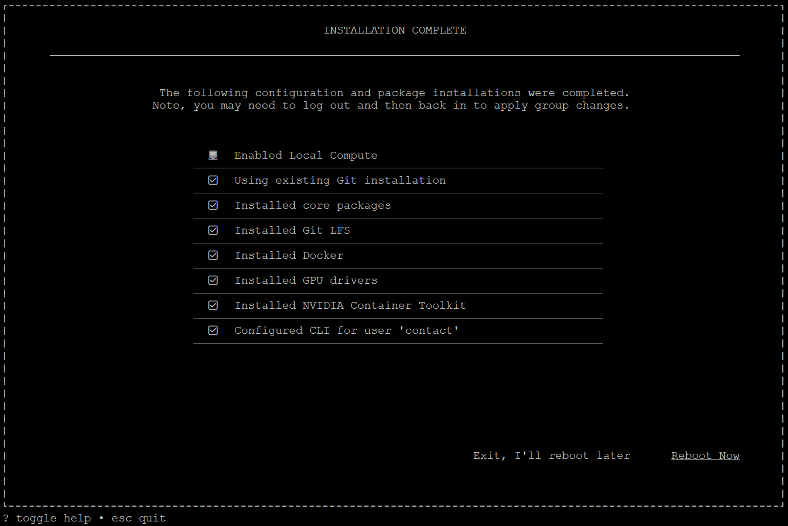

## Local Access: 

Now we need to configure the platform access credentials in the local Nvidia AI Workbench.

- Configure all access credentials such as VM IP, private key, etc.

  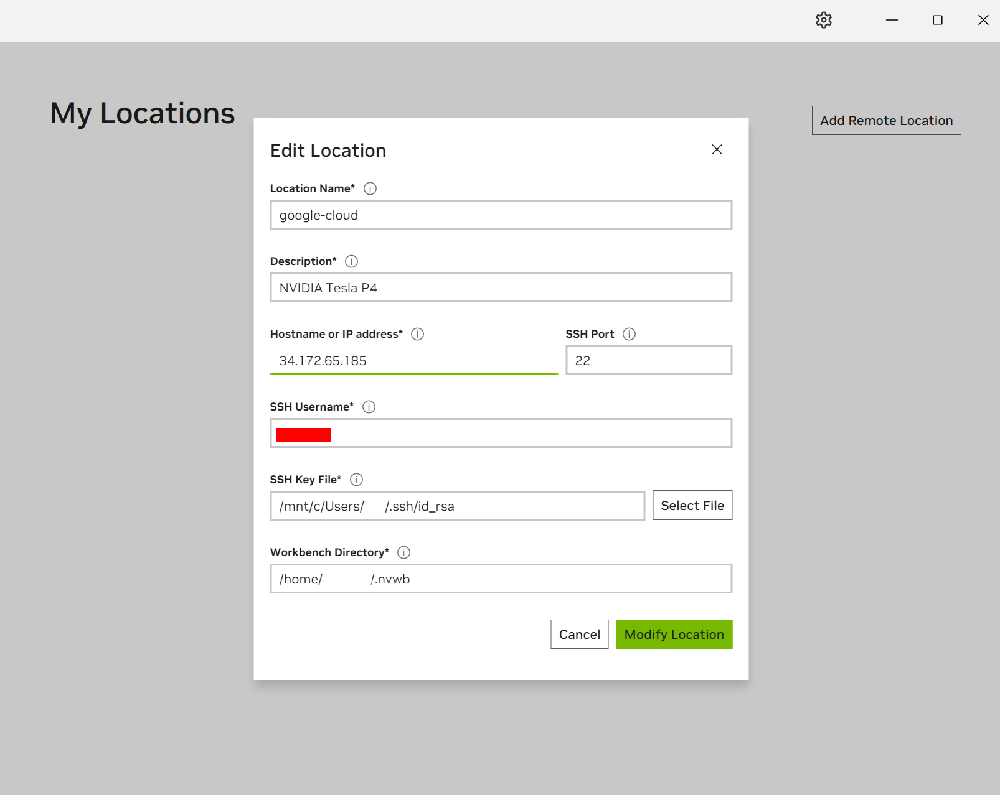

- If everything worked correctly, we will have access to our remote Nvidia AI Workbench server in the Google VM. In the case of our project, we select New Project.

  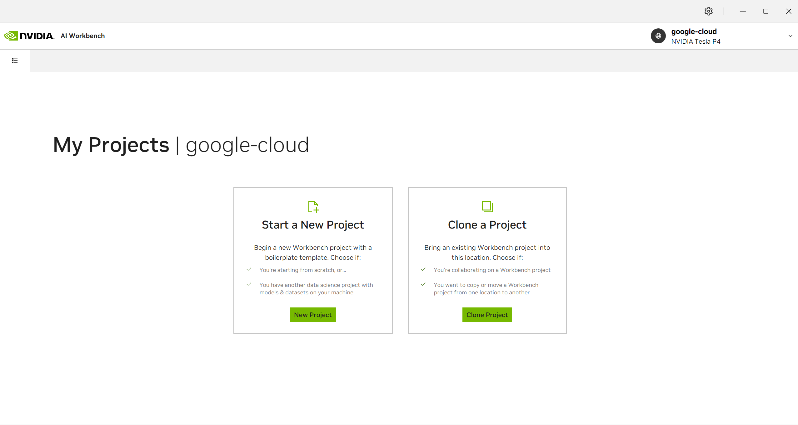

- Depending on the characteristics of your personal project, choose the ideal environment for you. In our case, we selected **Python with CUDA 12.2**.

  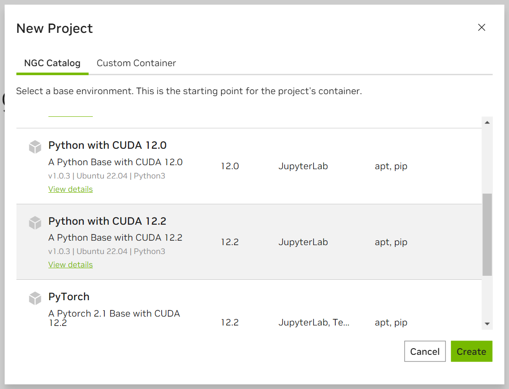

- If everything went well so far, you will have access to a window like the following one, where you can start working on the remote Nvidia AI Workbench.

  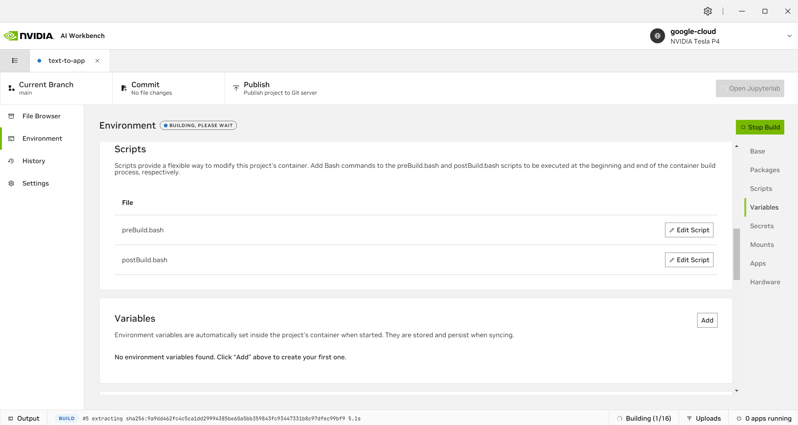

Now we will proceed to explain the operation of each of the elements of the project and how all together they perform the function of Txt2App.

# Ollama:

This project requires the use of LLM models to be able to generate the App code without having to use code, so we will have to install the Ollama service, this will give us access to use the language models we want through API and Ollama Python which will give us access to this API more easily in a Python program.

 

- Ollama Service: https://ollama.com/
- Ollama Python: https://github.com/ollama/ollama-python

We used the following LLM model to create code since it gave us the best results, but we invite you to try several models to carry out your tests.

- Deepseek Coder V2: https://ollama.com/library/deepseek-coder-v2

If you want to test only this model and operation, we leave you a Jupiter Notebook that you can run in the Nvidia AI Workbench to perform your own tests.

- [TEST NOTEBOOK](./Notebook/Text%20to%20App.ipynb)

# Frontend:

This frontend section is divided into two sections, since we have two important project elements here, which are the Main UI and the previewer. In both cases, the ReactJS framework was used, although with some modifications to be able to mount it on our FastAPI server (this will be detailed later).

## Preview App:

The app preview was done with a ReactJS library called `react-native-web` which converts native React Native code into a version viewable in our browser.

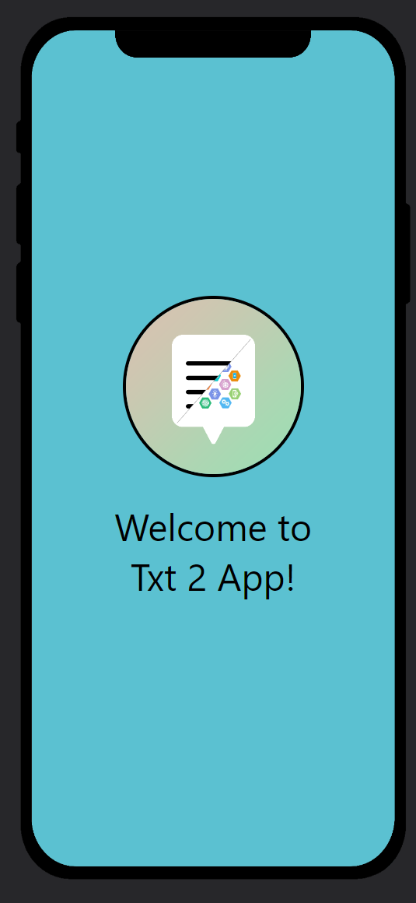 

This code is available at the following path:

- [CODE](./Code/app-render/src/)

## Main UI:

The main UI of our application provides us with an easy way to access the prompt of the desired app, preview and test it and finally generate an installable APK.

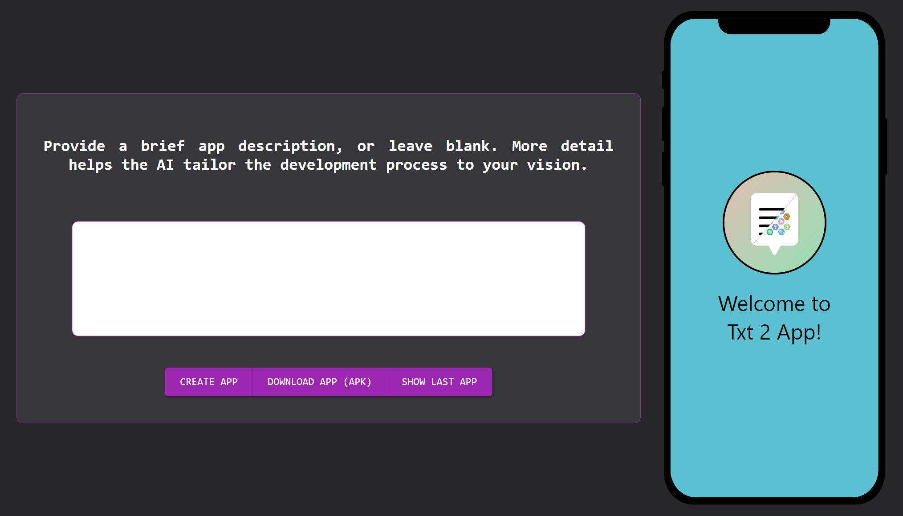 

This code is available at the following path:

- [CODE](./Code/frontend/src/)

# Build App Backend:

The app build process is done using the React Native framework version 0.73 along with the Android command-line tools. This project allows us to build a functional Android app by calling the npm deploy command as specified in the `package.json` provided by the project.

    ...
    "scripts": {
      "android": "react-native run-android",
      "ios": "react-native run-ios",
      "lint": "eslint .",
      "start": "react-native start",
      "test": "jest",
      "deploy": "cd android && ./gradlew :app:assembleRelease"
    }
    ...

This code is available at the following path:
- [Package JSON](./Code/txt2app/package.json)
- [CODE](./Code/txt2app/)

# Fastapi:

Finally, having all the backend and frontend elements configured, we can go straight to our API with [FastAPI](https://fastapi.tiangolo.com/), this was configured in our Nvidia AI Workbench to function as a Custom App.

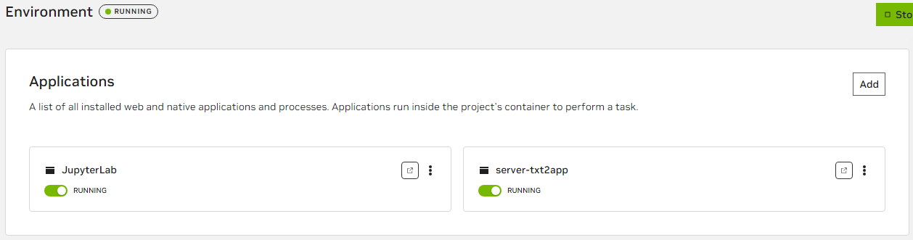 

The configurations that were made for the custom app were the following:

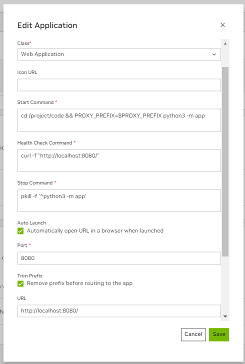

The most important thing here is that we use port 8080 and host 0.0.0.0 which would be the localhost.

## Uvicorn Server:

Due to the way Nvidia AI Workbench works we had to use a module called Uvicorn, which allows us to select the host and port through which we are going to deploy our API. It is very important that both the Host and the Port are configured identically to the custom app.

    # Modules
    import uvicorn
    # My App
    from main import app

    if __name__ == '__main__':
        uvicorn.run(app=app, port=8080, host="0.0.0.0")

This code is available at the following path:
- [CODE](./Code/app.py)

## Ollama Server:

Our API must be able to check if Ollama Server is on in order to use it within it, so we created a section of code that checks this and if it is not on, it runs it in the background.

    def check_server():
        try:
            check_output(["bash","command.sh"]) # ps -ef | grep ollama | grep serve -> This is the command in the .sh file. I've combined it into a single line for easier execution.
        except:
            DUMP = Popen(["ollama", "serve"])

If the server is up and running correctly we can call the LLM model directly from the API with the following route.

    @app.post("/api/ollama/generate")
    async def generate(item: Item):
        global app_code
        check_server()
        result = ollama.generate(model='deepseek-coder-v2:16b', prompt=preprocess(item.prompt), options={"temperature": 0.8})
        webpage = postprocess(result)
        file = open("app-render/src/smartphone.js", 'w')
        file.write(webpage)
        file.close()
        app_code = webpage
        build = Popen(["bash", "build.sh"])
        build.wait()
        data = ""
        with open("app-render/build/index.html") as f:
            data = f.read().replace('="/', '="')
        file = open("app-render/build/index.html", 'w')
        file.write(data)
        file.close()
        return {"result": webpage}

This code is available at the following path:
- [command.sh](./Code/command.sh)
- [build.sh](./Code/build.sh)
- [CODE](./Code/app.py)

## Static Website:

In order to correctly display the UI, the server needs to be able to deliver a static website, so this was configured for both [Frontend](#frontend) applications.

    ...
    def check_render():
    # Check Webpage Render 
    data = ""
    with open("app-render/build/index.html") as f:
        data = f.read().replace('="/', '="')
    file = open("app-render/build/index.html", 'w')
    file.write(data)
    file.close()
    
    # Check Webpage Main UI
    data = ""
    with open("frontend/build/index.html") as f:
        data = f.read().replace('="/', '="')
    file = open("frontend/build/index.html", 'w')
    file.write(data)
    file.close()
    ...
    templates1 = Jinja2Templates(directory="app-render/build")
    templates2 = Jinja2Templates(directory="frontend/build")
    app.mount("/render/static", StaticFiles(directory="app-render/build/static"), name="static1")
    app.mount("/render/assets", StaticFiles(directory="app-render/build/assets"), name="static2")
    app.mount("/static", StaticFiles(directory="frontend/build/static"), name="static3")
    app.mount("/assets", StaticFiles(directory="frontend/build/assets"), name="static4")
    ...
    @app.get('/render/')
    def index(request: Request):
        check_render()
        return templates1.TemplateResponse("index.html", {"request": request})

    @app.get('/')
    def index(request: Request):
        check_render()
        return templates2.TemplateResponse("index.html", {"request": request})

This code is available at the following path:
- [CODE](./Code/main.py)

## Build Android APK:

Finally, the last section of the APK we need to explore is the execution of the final app build. This is generated by the React Native project by making the following API call.

    @app.get("/api/buildapk")
    async def build_apk():
        file = open("txt2app/App.js", 'w')
        file.write(app_code)
        file.close()
        build = Popen(["bash", "buildApp.sh"])
        build.wait()
        return {"result":"ok"}

    @app.get("/api/downloadapk")
    async def download_apk():
        return FileResponse("txt2app/android/app/build/outputs/apk/release/app-release.apk", filename="txt2app.apk")

This code is available at the following path:
- [buildApp.sh](./Code/buildApp.sh)
- [CODE](./Code/main.py)

# Txt2App:

Now that we have finished explaining the entire technological stack that we have in our application, it is time to show how our webapp is used.


## Prompt:

The first thing that is important to clarify is that our AI is an LLM, therefore making a good description of your application will directly affect its quality, therefore we recommend that you be as specific as possible when creating an app.

Example Prompt
```
The app, titled "Counter Pro," is a simple yet intuitive application that allows users to count up and down using two buttons. Additionally, it features a third button that displays the local time on the screen.

Design Overview

The app's design is clean, modern, and easy to use. The color scheme is a combination of calming blues and whites, which provides a soothing user experience.

Layout

The app's layout is divided into three main sections, arranged using a flex layout:

Counter Section: This section takes up the majority of the screen and displays the current count in a large, bold font.
The background color of this section is a light blue (#ADD8E6).
The text color is a deep blue (#2F4F7F).
Position: This section is placed at the top of the screen, taking up about 60% of the screen height.
Button Section: This section contains three buttons: "Up," "Down," and "Time."
The buttons are arranged horizontally and are evenly spaced using justify-content: space-between.
Each button has a white background (#FFFFFF) and a blue border (#2F4F7F).
The button text is also blue (#2F4F7F).
Position: This section is placed below the Counter Section, taking up about 20% of the screen height.
Time Section: This section is displayed below the Button Section and shows the local time when the "Time" button is pressed.
The background color of this section is a light gray (#F7F7F7).
The text color is a dark gray (#333333).
Position: This section is placed at the bottom of the screen, taking up about 20% of the screen height.
Button Descriptions

Up Button:
Text: "Up" (blue, #2F4F7F)
Position: Leftmost button in the Button Section
Down Button:
Text: "Down" (blue, #2F4F7F)
Position: Middle button in the Button Section
Time Button:
Text: "Time" (blue, #2F4F7F)
Position: Rightmost button in the Button Section
Time Display

When the "Time" button is pressed, the local time is displayed in the Time Section. The time is shown in a 12-hour format with AM/PM indicators.

Time Text: The time text is displayed in a large, bold font (dark gray, #333333).
Time Background: The background of the Time Section remains light gray (#F7F7F7).
```

Once you have entered the description, you must press the Create App button.

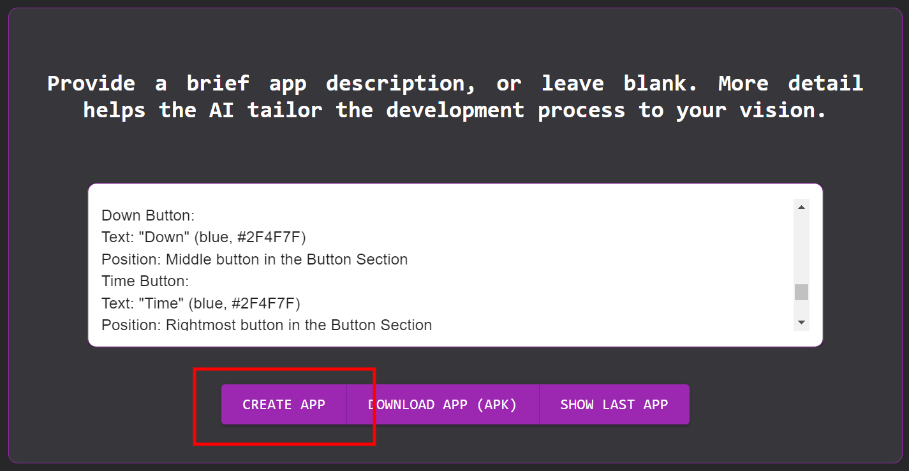

You will have to wait a few seconds for the LLM to generate your app. During this process, a waiting window will appear on your cell phone. Be patient, depending on your system, it could take between 10 - 30 seconds.

## Preview and Test:

We can see that the application we generated is fully functional and meets the requirements we requested. Remember that the more specific you are, the better the application will perform.

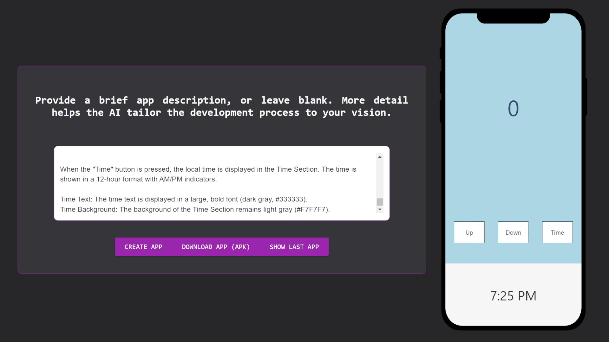

## Build and Download:

Then, if the result is suitable for us, we will press the Download APK button, this will generate our APK which you can install on any Android device or even upload it to the Playstore. The first time you generate an APK it may take a few minutes due to the setup of some dependencies required by React Native, the following builds will be done in less than 1 min.

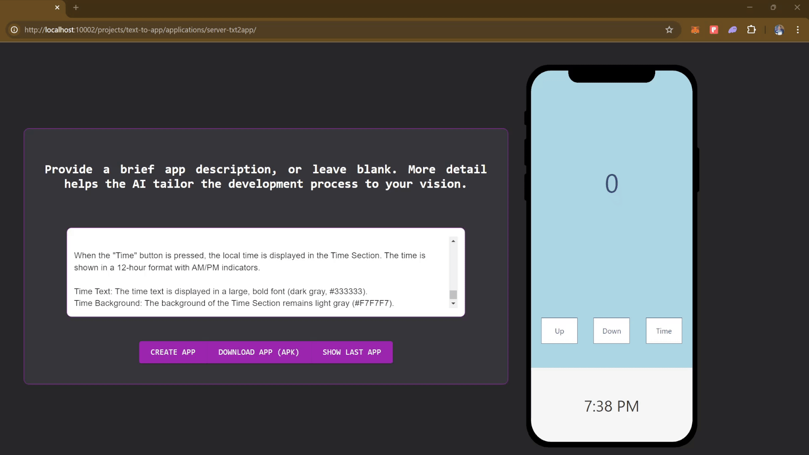

## Install the App:

Finally, since the application is fully functional, you can install it using the command `adb install -r txt2app.apk`.

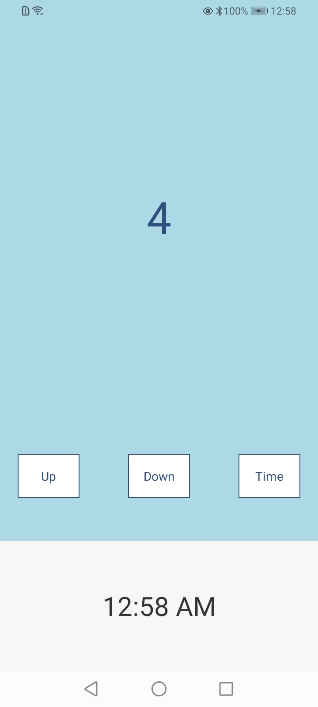 

You can see that the app is fully functional in the same way it works in our web simulator, we invite you to create your own applications.

# Commentary:

Txt2App is a groundbreaking solution designed to revolutionize the way mobile applications are developed. Leveraging the power of large language models (LLM) and Nvidia's AI Workbench, Txt2App enables users to turn any idea into a fully functional mobile app with ease. This innovative tool lowers the barriers to app development by automating many of the complex, technical tasks that traditionally require extensive programming knowledge. Whether you're an entrepreneur with a vision or a business looking for custom solutions, Txt2App simplifies the journey from concept to deployment.

### Empowering Users with Cutting-Edge AI

By integrating Nvidia's AI Workbench, Txt2App harnesses cutting-edge machine learning models to interpret natural language inputs and generate corresponding app features. This means users can describe their ideas in plain text, and Txt2App will handle the heavy lifting of coding, UI/UX design, and backend infrastructure. This fusion of LLM and AI-driven technology drastically reduces development time, while ensuring that the final product meets high performance and functionality standards.

### A New Era for App Development

Txt2App marks a significant shift in how applications are conceptualized, created, and delivered. It democratizes app development, making it accessible to non-technical users without compromising on the quality or complexity of the applications produced. As the world becomes increasingly mobile-centric, Txt2App opens doors for individuals and businesses to innovate and adapt swiftly, fostering a more inclusive and dynamic app ecosystem.

<br>


# References:

1. https://www.forbes.com/sites/timbajarin/2024/03/20/nvidias-ceo-on-the-democratization-of-coding/
2. https://ai.meta.com/blog/meta-llama-3/
3. https://docs.nvidia.com/ai-workbench/index.html
4. https://www.netguru.com/blog/mobile-app-challenges
