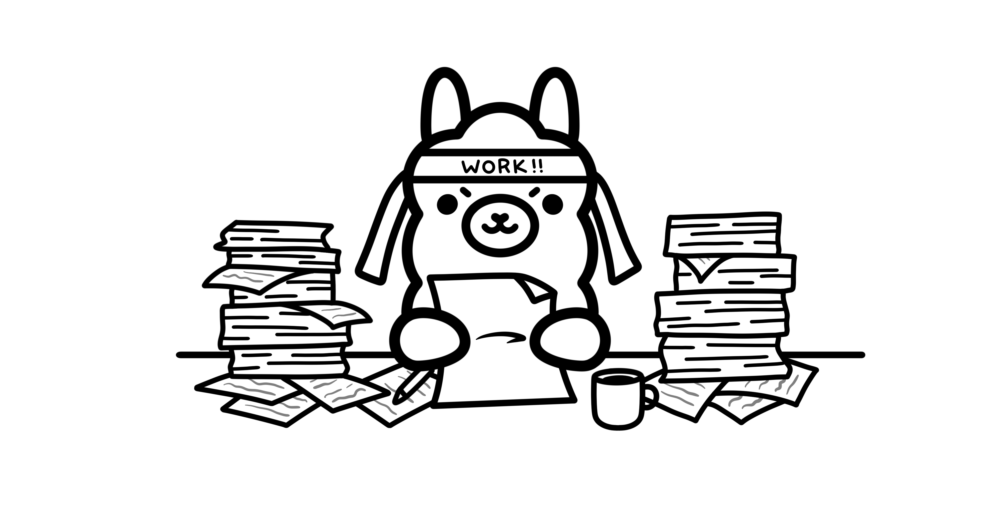

# Txt2App


Txt2App: Convierte cualquier idea en una app móvil perfectamente funcional, impulsada por LLM y Nvidia AI Workbench.

# Fastlinks:

Hi!, if you are a judge and want to review the code and Nvidia Ai Workbench Container here the links:

- **Nvidia Ai Workbench Container**: [OPEN VIDEO](pending...)
- **Video Demo**: [OPEN VIDEO](pending...)

# Introduction:

En un mundo cada vez más impulsado por la tecnología, la capacidad de desarrollar aplicaciones móviles no debería estar reservada solo para programadores expertos. Jensen Huang, CEO de Nvidia, ha destacado la necesidad de enfocarnos en aprender ingeniería de prompt en lugar de la programación tradicional, señalando: "It is our job to create computing technology such that nobody has to program. And that the programming language is human."


Los **LLMs** proporcionan la capacidad para procesar entradas de lenguaje natural y generación de texto (no limitandose a lenguaje natural), lo cual es una herramieta indispensable para lograr este objetivo.


**Nvidia AI Workbench** ofrece un entorno robusto para la creación, entrenamiento y optimización de modelos de inteligencia artificial basado en contenedores, sobre todo permite utilizar recursos tanto en la máquina local como en servidores externos, facilitando el desarrollo rapido desde entornos listos para trabajar, esto acelerando los tiempos de desarrollo.


# Problem:

Desarrollar aplicaciones móviles presenta diversos desafíos:

- **Complejidad del Código**: La programación de aplicaciones móviles involucra la escritura y depuración de código, lo que puede ser difícil sin una sólida experiencia técnica.

- **Diversidad de frameworks, versiones y plataformas**: Asegurar que una aplicación funcione de manera óptima en diferentes dispositivos requiere gestionar múltiples versiones y configuraciones, lo cual puede complicar el proceso de desarrollo.

- **Diseño de UI/UX**: Diseñar una buena UI/UX que cumpla con las expectativas de los usuarios, quienes ya están acostumbrados a patrones de diseño establecidos y actuales, puede ser una tarea aún más desafiante que desarrollar el propio backend de la aplicación.

<hr>


# Current Solutions:

- Flutter Flow: Esta solucion que provee herramientas para el diseño de interfaces, pero no provee ninguna capacidad de AI. https://www.flutterflow.io/product

- Appypie: Esta solucion text to app, permite realizar aplicaciones solo con un prompt de texto, sin embargo esta requiere de una suscripcion, es de codigo cerrado y el demo proporcionado por la pagina no provee evidencia del uso de AI. https://www.appypie.com/

- UI Bakery: Aunque esta pagina muestra de una mejor forma el diseño de interfaces mediante AI, no provee ninguna funcionalidad a la app, solo generando diseños base. https://uibakery.io/

# Solution: 

Presentamos **Txt2App**, la promesa de Huang se convierte en una realidad, accesible para todos, democratizando el desarrollo de aplicaciones y abriendo nuevas posibilidades para la creación de tecnología gracias a Nvidia Ai Workbench y los LLMs (Generative AI).


# Diagram and Summary:

El diagrama general de nuestra solucion es el siguiente, este es un summary de los servicios, pero los detallaremos mas adelante.


- Google Cloud VM: Estamos utilizando una VM de google con las siguientes caracteristicas.
  - OS: Ubuntu 24.04 LTS.
  - GPU: Nvidia Tesla T4 (16Gb).
  - RAM: 65 Gb.
  - HDD: 500 Gb.
  - vCPU: 10 cores.
- Nvidia AI Workbench: Se utiliza el toolkit de Nvidia para realizar el desarrollo y despleuigue rapido de nuestra aplicacion.
  - https://docs.nvidia.com/ai-workbench/user-guide/latest/overview/introduction.html
- Ollama Server: Utilizamos el servicio de Ollama server para utilizar los modelos LLM utilizados en el proyecto.
  - LLM Model: Deepseek Coder V2.
    - https://ollama.com/library/deepseek-coder-v2
- ReactJS: Este fue el framework web para realizar las UI del proyecto, utilizamos ReactJS puro sin framework adicional.
  - Main UI: Esta es la interfaz principal del proyecto donde se visualiza la ventana de texto y la previsualizacion de la App.
  - App Preview: Esta interfaz pre-renderiza la app para que la pruebe el usuario antes de convertirla en APK.
- React Native:
  - App Builder: Se utiliza el build nativo de Android para convertir el codigo de React en un codigo nativo de Android.
- Fastapi: Utilizamos este framework para realizar la API completa de nuestra aplicacion.
  - Static Website: Esta seccion de la API se usa como server para visualizar la UI desde el browser.
  - API: Esta seccion comunica la UI con los servicios de generacion, previsualizacion y build.

# Google VM:

Seleccionar el tipo de máquina virtual para el proyecto fue una tarea sencilla, especialmente al considerar que Google ofrece una gran variedad de GPU Nvidia. Después de realizar algunas pruebas en el calculador, se decidió utilizar una VM con las siguientes características.


<hr>

VM Selection Summary:

| HW/SW  | Selected Value         |
| ------ | ---------------------- |
| OS     | Ubuntu 24.04 LTS       |
| GPU    | Nvidia Tesla T4 (16Gb) |
| RAM    | 65 Gb                  |
| HDD    | 500 Gb                 |
| vCPU   | 10 cores               |

Se utilizo una maquina bastante potente en cuestion de RAM y vCPU ya que teniamos que experimentar la mejor seleccion de modelo LLM y no tener problemas con limitaciones de recursos, esto claro contemplando que no ibamos a utilizar modelos como llama3 405b, los cuales ocupan recuros de HW muy elevados en costos.

## SSH Setup:

Algo importante que hay que configurar para que no tengamos ningun problema en la siguiente seccion, es la configuracion de acceso SSH que que requerimos para configurar la VM y el acceso mediante el Nvidia AI Workbench.

- En nuestra pc local tendremos que crear una RSA Keypair, esto pude realizarse de muchas formas, sin embargo nosotros usaremos el comando `ssh-keygen` de la libreria OpenSSH.

  

- La private key estara ya en nuestra carpeta .shh pero ocuparemos los datos del archivo id_rsa.pub, la que es la clave publica.

  

- Iremos a la seccion inferior de la configuracion de VM:

  

- Seleccionamos Advanced Options - Security - Manage Access - Add manually generated SSH keys, ahi colocaremos la public key del archivo id_rsa.pub.

  

- Una vez echo esto ya tendremos todo listo para utilizar la VM sin ningun inconveniente mediante SSH, la ip address de la VM estara disponible despues de unos segundos.

  

# Nvidia AI Workbench:

Ya con la VM configurada tendremos que conectarnos a ella mediante SSH para poder configurarla, esto puedes realizarlo con cualquier programa para ese fin, incluso GC te provee una interfaz web para realizar este proceso sin problema.

## Ubuntu Remote Install: 
- Abre una terminal SSH en el programa que prefieras (por ejemplo la web ui de GC).
  

- Una vez dentro de la VM pondremos el siguiente comando sin mas.

      mkdir -p $HOME/.nvwb/bin && \
      curl -L https://workbench.download.nvidia.com/stable/workbench-cli/$(curl -L -s https://workbench.download.nvidia.com/stable/workbench-cli/LATEST)/nvwb-cli-$(uname)-$(uname -m) --output $HOME/.nvwb/bin/nvwb-cli && \
      chmod +x $HOME/.nvwb/bin/nvwb-cli && \
      sudo -E $HOME/.nvwb/bin/nvwb-cli install

- Este comando instalara todas las dependencias del Nvidia AI Workbench, pero iremos paso a paso, tendras que aceptar los terminos de uso del programa.

  

- Para este proyecto se utilizo Docker, pero tu puedes experimentar con Podman si lo deseas.

  

- Recomendamos aqui que se haga la instalacion de los drivers como lo indica Nvidia AI Workbench, en nuestra maquina virtual funciono sin ningun problema.
  
  

- Empezara el proceso de instalacion, segun tu VM puede tardar menos de 2 min o mas de 5 min como indica Nvidia AI Workbench, sin embargo al usar una VW de Google no habra ningun problema por la velocidad de internet.

  

- Una vez terminado todo el proceso se reiniciara la VM, esto cerrara nuestra sesion de SSH, sin embargo ya no sera necesaria, ya podremos acceder desde nuestra Nvidia AI Workbench Local.

  

## Local Access: 

Ahora tenemos que configurar las credenciales de accesso a la platafoma en Nvidia AI Workbench local.

- Configura todas las credenciales de acceso como IP de la VM, private key, etc.

  

- Si todo funciono correctamente ya tendremos accesso a nuestro server remoto de Nvidia AI Workbench en la VM de google, en el caso de nuestro proyecto seleccionamos New Project.

   

- Segun las caraterosticas de tu proyecto personal elige el enviroment ideal para ti, en nuestro caso seleccionamos **Python with CUDA 12.2**.

   

- Si todo salio bien hasta ahora tendras acceso a una ventana como la siguiente, donde ya podras empezar a trabajar en el Nvidia AI Workbench remoto.

   

Ahora vamos a proceder a explicar el funcionamiento de cada unos de los elementos del proyecto y como todos juntos realizan la funcion de Txt2App.

# Ollama:

Este proyecto requiere el uso de modelos LLM para poder realizar la generacion del codigo de la App sin necesidad de utilizar codigo, asi que tendremos que instalar el servicio Ollama, este nos dara acceso a utilizar mediante API los modelos de lenguaje que querramos y Ollama Python el cual nos dara acceso a esta API mas facilmente en un programa de python.

 

- Ollama Service: https://ollama.com/
- Ollama Python: https://github.com/ollama/ollama-python

Nosotros utilizamos el siguiente modelo LLM para realizar la creacion de codigo ya que es la que nos daba los mejores resultados pero te invitamos a probar varios modelos para realizar tus pruebas.

- Deepseek Coder V2: https://ollama.com/library/deepseek-coder-v2

Si quieres realizar pruebas unicamente de este modelo y funcionamiento te dejamos un Notebook de Jupiter que puedes correr en el Nvidia AI Workbench para realizar pruebas propias.

- [TEST NOTEBOOK](./Notebook/Text%20to%20App.ipynb)

# Frontend:

Esta seccion de frontend esta dividida en dos secciones, ya que tenemos dos elementos del proyecto importantes aqui, el cual es la Main UI y el pre visualizador. En ambos casos se utilizo el framework de ReactJS, aunque con algunas modificaciones para poder montarlo en nuestro servidor de FastAPI (esto se detallara mas adelante).

## Preview App:

La previsualizacion de la app se realizo con una liberia de ReactJS llamada `react-native-web` esta convierte codigo nativo de React Native en una version visualizable en nuestro browser.

 

Este codigo esta disponible en la siguiente ruta:

- [CODE](./Code/app-render/src/)

## Main UI:

La UI principal de nuestra aplicacion nos provee una forma sencilla de acceder escribir el prompt de la app que se desea, previsualizarla y probarla y finalmente generar un APK instalable.

 

Este codigo esta disponible en la siguiente ruta:

- [CODE](./Code/frontend/src/)

# Build App Backend:

El proceso de build de la app se realiza mediante el framework de React Native version 0.73 junto con las command-line tools de Android. Este proyecto nos permite construir un app funcional de android al llamar el comando npm deploy como esta especificado en el `package.json` que provee el proyecto.

    ...
    "scripts": {
      "android": "react-native run-android",
      "ios": "react-native run-ios",
      "lint": "eslint .",
      "start": "react-native start",
      "test": "jest",
      "deploy": "cd android && ./gradlew :app:assembleRelease"
    }
    ...

Este codigo esta disponible en la siguiente ruta:
- [Package JSON](./Code/txt2app/package.json)
- [CODE](./Code/txt2app/)

# Fastapi:

Finalmente ya teniendo todos los elementos de backend y de frontend configurados ya podemos ir de lleno a nuestra API con [FastAPI](https://fastapi.tiangolo.com/), esta se configuro en nuestro Nvidia AI Workbench para funcionar como una Custom App.

 

Las configuraciones que se realizaron para la custom app fueron las siguientes:


Lo mas importante aqui es que utilizamos el puerto 8080 y de host 0.0.0.0 lo que seria el localhost.

## Uvicorn Server:

Debido a la forma en la que funciona el Nvidia AI Workbench tuvimos que utilizar un modulo llamado Uvicorn, que nos permite seleccionar el host y el puerto por el cual vamos a desplegar nuestra API. Es muy importante que tanto el Host como el Port esten configurados identicos a la custom app.

    # Modules
    import uvicorn
    # My App
    from main import app

    if __name__ == '__main__':
        uvicorn.run(app=app, port=8080, host="0.0.0.0")

Este codigo esta disponible en la siguiente ruta:
- [CODE](./Code/app.py)

## Ollama Server:

Nuestra API debe de poder revisar si Ollama Server esta encedido para poder utilizarlo dentro de la misma, asi que realizamos una seccion de codigo que revisa esto y si no esta encendido lo ejecuta en background.

    def check_server():
        try:
            check_output(["bash","command.sh"]) # ps -ef | grep ollama | grep serve -> This is the command in the .sh file. I've combined it into a single line for easier execution.
        except:
            DUMP = Popen(["ollama", "serve"])

Si el servidor esta encedido correctamente podremos llamar al modelo LLM directamente desde la API con la siguiente ruta.

    @app.post("/api/ollama/generate")
    async def generate(item: Item):
        global app_code
        check_server()
        result = ollama.generate(model='deepseek-coder-v2:16b', prompt=preprocess(item.prompt), options={"temperature": 0.8})
        webpage = postprocess(result)
        file = open("app-render/src/smartphone.js", 'w')
        file.write(webpage)
        file.close()
        app_code = webpage
        build = Popen(["bash", "build.sh"])
        build.wait()
        data = ""
        with open("app-render/build/index.html") as f:
            data = f.read().replace('="/', '="')
        file = open("app-render/build/index.html", 'w')
        file.write(data)
        file.close()
        return {"result": webpage}

Este codigo esta disponible en la siguiente ruta:
- [command.sh](./Code/command.sh)
- [build.sh](./Code/build.sh)
- [CODE](./Code/app.py)

## Static Website:

Para mostrar correctanente la UI es necesario que el server sea capaz de entregar un sitio web estatico, asi que la configuracion de esto se realizo para ambas aplicaciones del [Frontend](#frontend).

    ...
    def check_render():
    # Check Webpage Render 
    data = ""
    with open("app-render/build/index.html") as f:
        data = f.read().replace('="/', '="')
    file = open("app-render/build/index.html", 'w')
    file.write(data)
    file.close()
    
    # Check Webpage Main UI
    data = ""
    with open("frontend/build/index.html") as f:
        data = f.read().replace('="/', '="')
    file = open("frontend/build/index.html", 'w')
    file.write(data)
    file.close()
    ...
    templates1 = Jinja2Templates(directory="app-render/build")
    templates2 = Jinja2Templates(directory="frontend/build")
    app.mount("/render/static", StaticFiles(directory="app-render/build/static"), name="static1")
    app.mount("/render/assets", StaticFiles(directory="app-render/build/assets"), name="static2")
    app.mount("/static", StaticFiles(directory="frontend/build/static"), name="static3")
    app.mount("/assets", StaticFiles(directory="frontend/build/assets"), name="static4")
    ...
    @app.get('/render/')
    def index(request: Request):
        check_render()
        return templates1.TemplateResponse("index.html", {"request": request})

    @app.get('/')
    def index(request: Request):
        check_render()
        return templates2.TemplateResponse("index.html", {"request": request})

Este codigo esta disponible en la siguiente ruta:
- [CODE](./Code/main.py)

## Build Android APK:

Finalmente la ultima seccion del APK que tenemos que explorar es la ejecucion del build de la app final. Esto se genera mediante el proyecto de React Native al realizar la siguiente API call.

    @app.get("/api/buildapk")
    async def build_apk():
        file = open("txt2app/App.js", 'w')
        file.write(app_code)
        file.close()
        build = Popen(["bash", "buildApp.sh"])
        build.wait()
        return {"result":"ok"}

    @app.get("/api/downloadapk")
    async def download_apk():
        return FileResponse("txt2app/android/app/build/outputs/apk/release/app-release.apk", filename="txt2app.apk")

Este codigo esta disponible en la siguiente ruta:
- [buildApp.sh](./Code/buildApp.sh)
- [CODE](./Code/main.py)

# Txt2App:

Ya terminado de explicar todo el stack tecnologico que tenemos en nuestra aplicacion es la hora de mostrar como se utiliza nuestra webapp.


## Prompt:

Lo primero que es importante de aclarar es que nuestra AI es una LLM, por lo tanto la realizacion de una buena descripcion de tu aplicacion afectara directamente a la calidad de la misma, por lo tanto recomendamos que seas lo mas especifico posible cuando realices una app.

Example Prompt
```
The app, titled "Counter Pro," is a simple yet intuitive application that allows users to count up and down using two buttons. Additionally, it features a third button that displays the local time on the screen.

Design Overview

The app's design is clean, modern, and easy to use. The color scheme is a combination of calming blues and whites, which provides a soothing user experience.

Layout

The app's layout is divided into three main sections, arranged using a flex layout:

Counter Section: This section takes up the majority of the screen and displays the current count in a large, bold font.
The background color of this section is a light blue (#ADD8E6).
The text color is a deep blue (#2F4F7F).
Position: This section is placed at the top of the screen, taking up about 60% of the screen height.
Button Section: This section contains three buttons: "Up," "Down," and "Time."
The buttons are arranged horizontally and are evenly spaced using justify-content: space-between.
Each button has a white background (#FFFFFF) and a blue border (#2F4F7F).
The button text is also blue (#2F4F7F).
Position: This section is placed below the Counter Section, taking up about 20% of the screen height.
Time Section: This section is displayed below the Button Section and shows the local time when the "Time" button is pressed.
The background color of this section is a light gray (#F7F7F7).
The text color is a dark gray (#333333).
Position: This section is placed at the bottom of the screen, taking up about 20% of the screen height.
Button Descriptions

Up Button:
Text: "Up" (blue, #2F4F7F)
Position: Leftmost button in the Button Section
Down Button:
Text: "Down" (blue, #2F4F7F)
Position: Middle button in the Button Section
Time Button:
Text: "Time" (blue, #2F4F7F)
Position: Rightmost button in the Button Section
Time Display

When the "Time" button is pressed, the local time is displayed in the Time Section. The time is shown in a 12-hour format with AM/PM indicators.

Time Text: The time text is displayed in a large, bold font (dark gray, #333333).
Time Background: The background of the Time Section remains light gray (#F7F7F7).
```

Una vez puesta la descripcion deberas presionar el boton de Create App.


Deberas esperar unos segundos a que la LLM genere tu app, en este proceso aparecera una ventana espera en el celular. Ten paciencia segun tu sistema podria tardar entre 10 - 30 segundos.

## Preview and Test:

Podemos observar que la aplicacion que generamos es completamente funcional y cumple con los requerimietos que solicitamos, recuerda que mientras mas especifico seas, la aplicacion tendra un mejor funcionamiento. 


## Build and Download:

Finalmente si el resultado es adecuado para nosotros pasaremos a presionar el boton de Download APK, este generara nuestra APK la cual podras instalar en cualquier dispositivo Android o incluso subirla a la Playstore. La primera vez que generes una APK puede llegar a tardar unos minutos debito al setup de algunas dependencias que exige React Native, los siguientes builds se haran en menos de 1 min.


## Install the App:

Por ultimo ya que la aplicacion es totalmente funcional, podras instalarla mediante el comando `adb install -r txt2app.apk`.

 

Pueden ver que la app es totalmente funcional de la misma forma que funciona en nuestro simulador web, los invitamos a crear sus propias aplicaciones.

# Commentary:

# References: